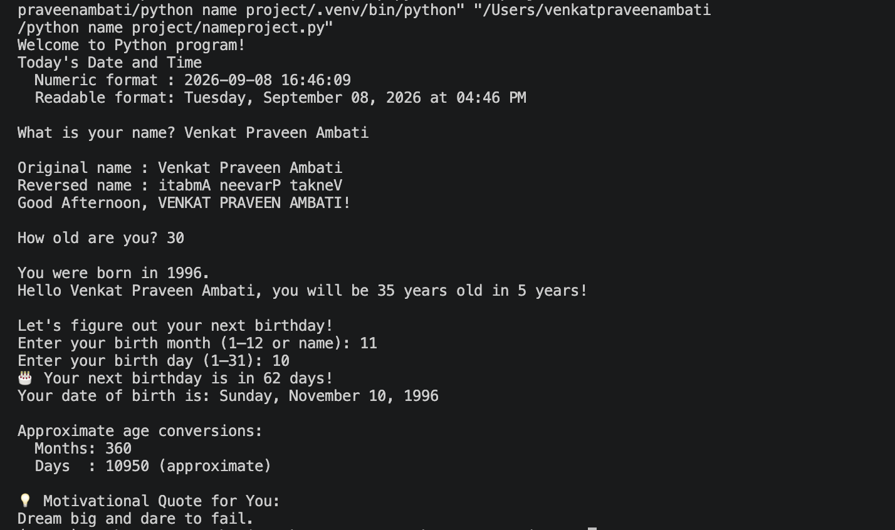

📝 Name Project
A beginner-friendly Python CLI program that asks for your name, age, and birth date, then provides personalized information such as your reversed name, greeting, birth year, next birthday, approximate age conversions, and a motivational quote.
This project is designed to practice Python basics, user input, strings, dates, conditionals, and formatting.

✨ Features
👤 Prompt the user for their name
🔄 Reverse the entered name
👋 Display a personalized greeting based on the time of day
🎂 Calculate the user's approximate birth year
📅 Calculate the user's next birthday
🗓️ Display the date of birth in a readable format
📊 Convert age into approximate months and days
💡 Display a motivational quote
🕐 Display the current date and time in numeric and readable formats
💻 Runs entirely in the terminal
📦 Uses only the Python standard library
🧰 Tech Stack
Python 3.8+
Python Standard Library
No external dependencies
📁 Project Structure
NameProject/
│
├── nameproject.py
├── ss.png
├── README.md
├── LICENSE
└── .venv/

.venv/ is a local virtual environment and should normally be excluded from Git using .gitignore.
🚀 Quick Start
1. Clone the Repository
git clone  https://github.com/VenkatPraveenAmbati/python-name-project.git
cd NameProject

2. Create a Virtual Environment
Creating a virtual environment is optional for this project, but recommended.
macOS / Linux
python3 -m venv .venv

Windows
python -m venv .venv

3. Activate the Virtual Environment
macOS / Linux
source .venv/bin/activate

Windows PowerShell
.venv\Scripts\Activate.ps1

Why use .venv?
A virtual environment keeps your project's Python environment isolated from other projects.
Although this project currently has no external dependencies, using a virtual environment is a good Python development practice.

▶️ Run the Program
macOS / Linux
python3 nameproject.py

Windows
python nameproject.py

🖥️ Execution Screenshot
Here's an example of the program running in the terminal:

📸 Example Output
Welcome to Python program!
Today's Date and Time
  Numeric format : 2026-09-08 16:46:09
  Readable format: Tuesday, September 08, 2026 at 04:46 PM

What is your name? Venkat Praveen Ambati

Original name : Venkat Praveen Ambati
Reversed name : itabmA neevarP takneV
Good Afternoon, VENKAT PRAVEEN AMBATI!

How old are you? 30

You were born in 1996.
Hello Venkat Praveen Ambati, you will be 35 years old in 5 years!

Let's figure out your next birthday!
Enter your birth month (1–12 or name): 11
Enter your birth day (1–31): 10

🎂 Your next birthday is in 62 days!

Your date of birth is: Sunday, November 10, 1996

Approximate age conversions:
  Months: 360
  Days  : 10950 (approximate)

💡 Motivational Quote for You:
Dream big and dare to fail.

🧪 Testing
This is a small CLI application, so manual testing can be performed by running the program and entering different values.
Consider testing:

Different names
Different ages
Different birth months
Different birth days
Birthday dates that have already passed this year
Birthday dates later in the current year
Different times of day for the greeting
Automated tests can be added later using pytest if the project grows.
📌 Notes
The age conversions are approximate:
Months are calculated using age × 12
Days are calculated approximately using age × 365
The program uses the current system date and time when it runs.
📜 License
This project is licensed under the MIT License — see the LICENSE file for details.
🤝 Contributing
Contributions are welcome!
For major changes, please open an issue first to discuss what you would like to change.

Feel free to submit a pull request for improvements, bug fixes, or new features.